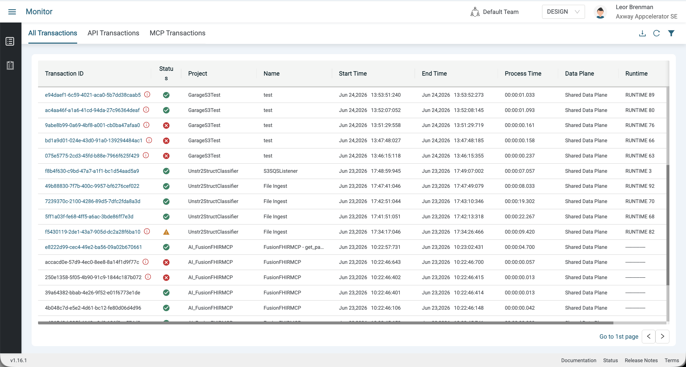
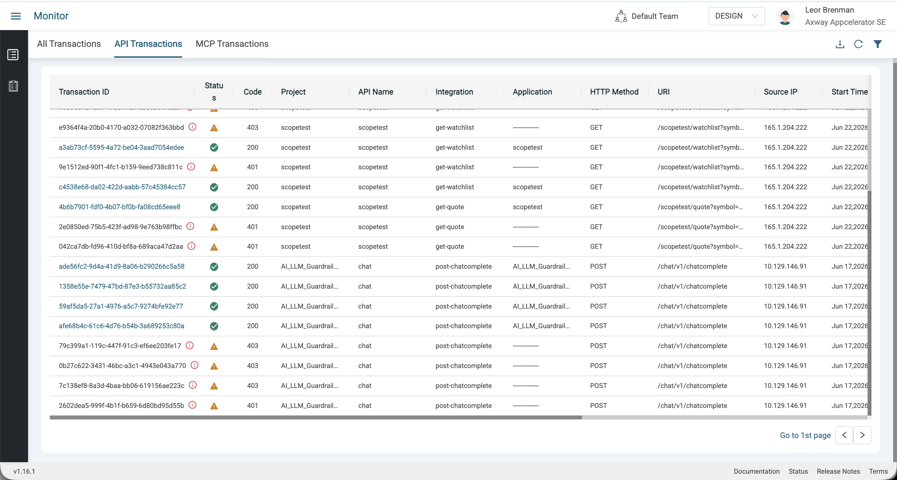
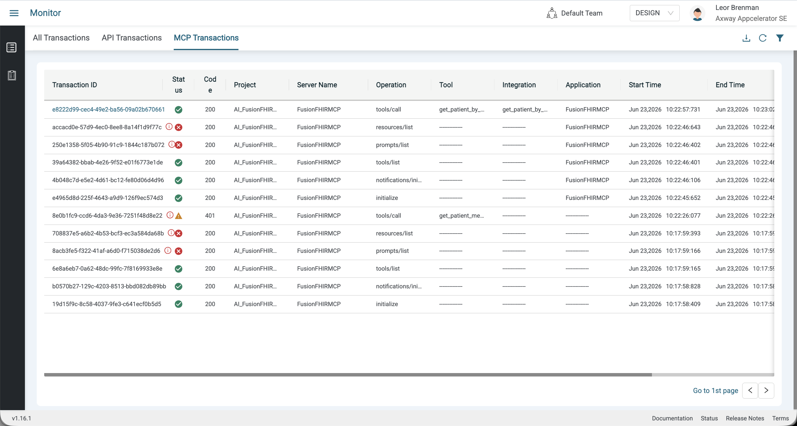
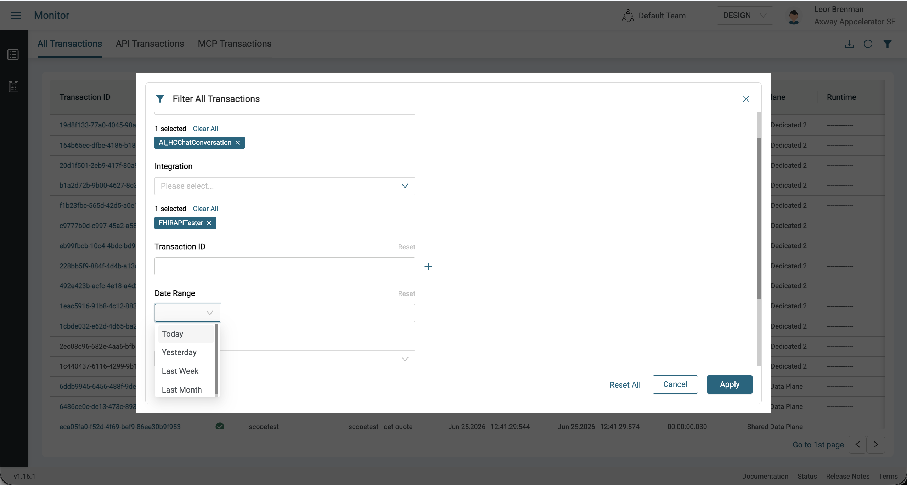
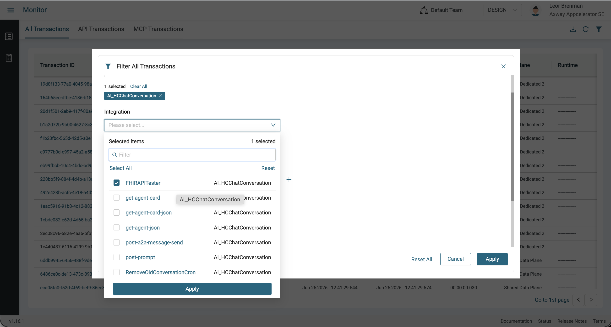
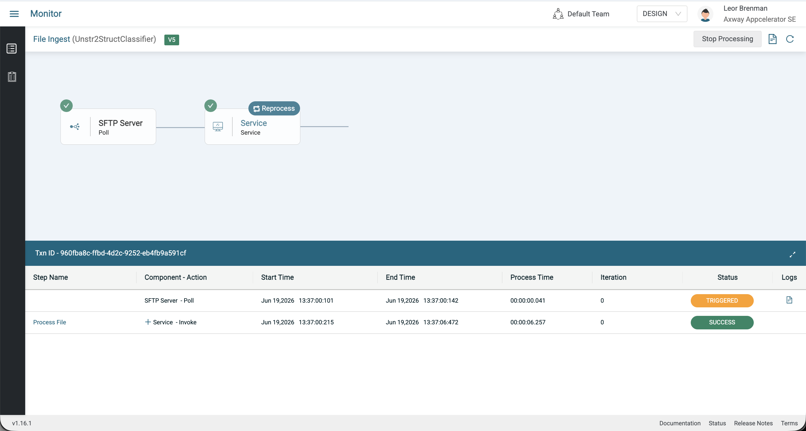
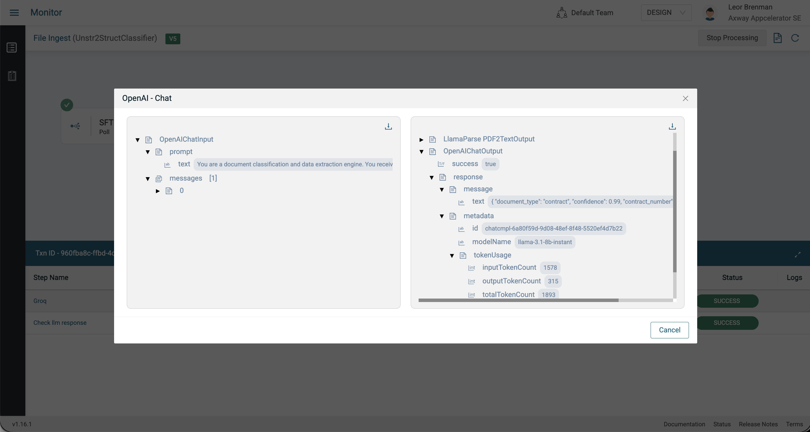
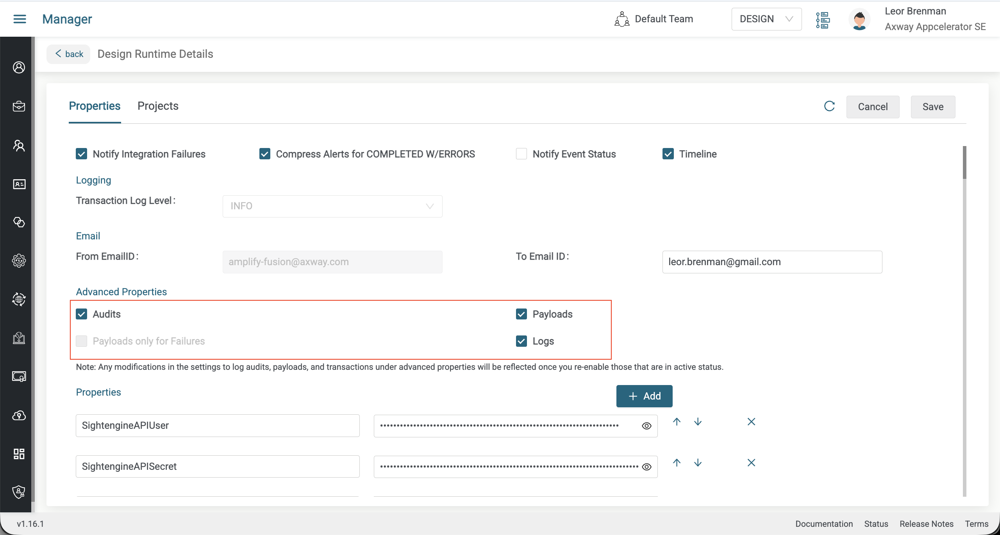
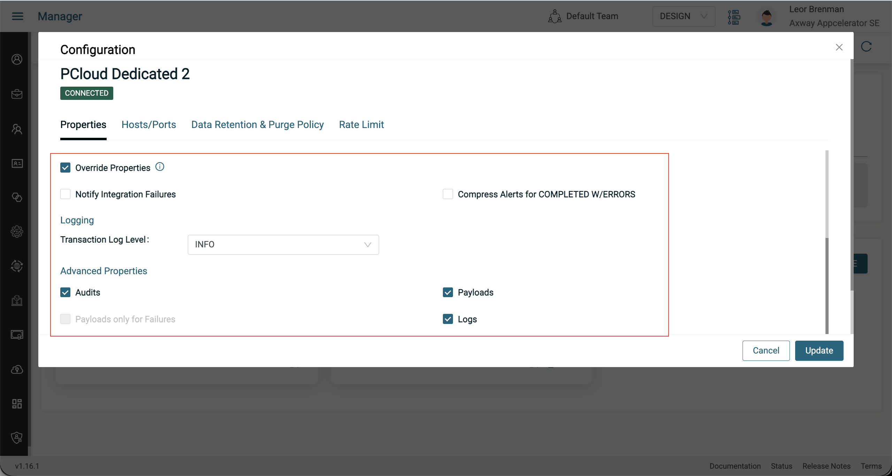
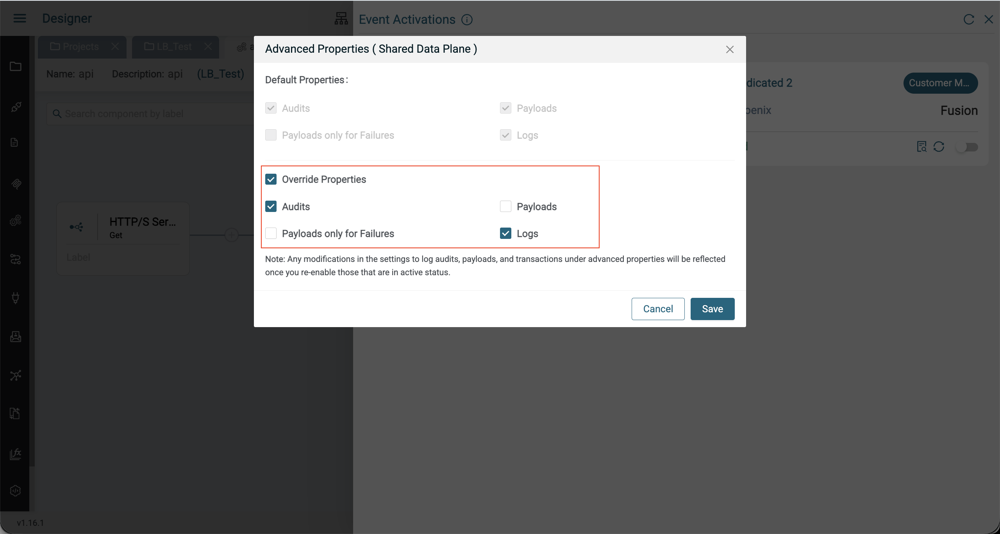

# Amplify Fusion - Transaction Audits and Payloads

In Amplify Fusion, integration transaction data can be collected to aid in debugging.

The Monitor Module Transaction screen displays the transactions that occured as well as API and MCP specific presentations. Transaction data is stored in Amplify Fusion Data Plane and the Amplify Studio (Control Plane) once retrieved when user clicks on a transaction in the Monitor. Transactions show status, start time, end time, execution time and more that can be useful to track and debug integrations.

  
  
  

Retention and purge policies for control planes and data planes can be found [here](https://docs.axway.com/bundle/amplify_integration/page/docs/manager_module/manage_the_environments/purge_transaction_data/index.html).

Audit steps are stored on the data plane in the Kubernetes EFS. Details on locating the audit and payload data can be found [here](https://gist.github.com/lbrenman/6a932dc5aaa8e3d9edb208957da7cf05).

## Filter

A powerful filter can be used to filter and find transactions.

  
  

## Report

Any filtered or non filtered transaction list can be exported from the UI as a csv file for further analysis.

## Audits and Payloads

Transactions can optionally, also display audit steps (the components in the integration that executed) and payloads (the value of the variables at each step of the execution) for integrations that executed.

  
  

The audit steps with payloads also make it possible to reprocess a transaction from a given point with the data present at that component, as shown above.

> Note that for API's and MCP proxies, exececution details are obviously not captured

## Configuration

In order to collect audits and payloads, you need to enable them at the environment level (DESIGN, CHECK, LIVE).

  

These settings would apply to any transaction that run in the evironment (DESIGN, CHECK, LIVE). You can override these settings at the non shared data plane level.

  


These settings would apply to any transaction that run in the specific data plane. You can override both settings at the activation level, when you are activating your integration.

  

  These settings would apply for the activated integration only.

In general, it is recommended to minimize audits and payloads in production as the EFS access can impact data plane performance. For example, the Payloads on Failure option is available for minimizing the performance impact.

## API Support

Transactions can be programmatically retrieved using the /api/monitor/dashboard/data/get_transactions_batch API method. The Monitor API can be found [here](./FusionMonitorOpenapi.yaml).

A sample curl command is:

```bash
curl --location 'https://services.sandbox.fusion.services.axway.com/api/monitor/dashboard/data/get_transactions_batch?size=30' \
--header 'Accept: application/json' \
--header 'Accept-Language: en-US,en;q=0.9' \
--header 'DNT: 1' \
--header 'ENV-MODE: DESIGN' \
--header 'Origin: https://axway-appc-se.sandbox.fusion.services.axway.com' \
--header 'Referer: https://axway-appc-se.sandbox.fusion.services.axway.com/' \
--header 'Content-Type: application/json' \
--header 'Authorization: Bearer ey...uolqDkw' \
--data '{"transactionType":"ALL","generateBatches":true,"forwardDirection":true}'
```

a sample response is:

```json
{
    "transactions": [
        {
            "tid": "6a3d5aca4304e8b721c860a0",
            "transactionId": "19d8f133-77a0-4045-98ae-2fbc267f3089",
            "serviceName": "get-quote",
            "status": "COMPLETED",
            "serviceId": "20efd7fb-b934-43eb-a87b-47a380111130",
            "projectName": "scopetest",
            "projectId": "f13b7542-3a67-478e-af0a-6af1b25d5f2c",
            "runtime": "",
            "responsetime": "00:00:00.023",
            "hasWarning": false,
            "isEvent": true,
            "clusterName": "PCloud Dedicated 2",
            "clusterRefId": "c0be9a1a30f445f59e6d2438d20d34b3",
            "clusterType": "PRIVATE_CLOUD",
            "baseTag": "EMPTY",
            "application": {
                "id": "46d14059-c3ca-47b9-a3cf-5a87c44921cb",
                "name": "scopetest"
            },
            "api": {
                "id": "4c03ce62-76ca-4643-89df-443d64c4db60",
                "name": "scopetest"
            },
            "request": {
                "ip": "10.129.146.91",
                "uri": "/scopetest/quote?symbol=appl",
                "method": "GET"
            },
            "responseCode": "200",
            "integrationFlowInvoked": true,
            "changed": false,
            "creationDateTime": 1782405833269,
            "modifiedDateTime": 1782405833292
        },
        {
            "tid": "6a3d5ac94304e8b721c8609f",
            "transactionId": "164b65ec-dfbe-4186-b188-ebda17060b49",
            "serviceName": "get-quote",
            "status": "COMPLETED",
            "serviceId": "20efd7fb-b934-43eb-a87b-47a380111130",
            "projectName": "scopetest",
            "projectId": "f13b7542-3a67-478e-af0a-6af1b25d5f2c",
            "runtime": "",
            "responsetime": "00:00:00.019",
            "hasWarning": false,
            "isEvent": true,
            "clusterName": "PCloud Dedicated 2",
            "clusterRefId": "c0be9a1a30f445f59e6d2438d20d34b3",
            "clusterType": "PRIVATE_CLOUD",
            "baseTag": "EMPTY",
            "application": {
                "id": "46d14059-c3ca-47b9-a3cf-5a87c44921cb",
                "name": "scopetest"
            },
            "api": {
                "id": "4c03ce62-76ca-4643-89df-443d64c4db60",
                "name": "scopetest"
            },
            "request": {
                "ip": "10.129.146.91",
                "uri": "/scopetest/quote?symbol=appl",
                "method": "GET"
            },
            "responseCode": "200",
            "integrationFlowInvoked": true,
            "changed": false,
            "creationDateTime": 1782405832607,
            "modifiedDateTime": 1782405832626
        },
        .
        .
        .
        {
            "tid": "6a3d5a2c4304e8b721c86078",
            "transactionId": "815abf6f-af86-4d74-bac1-3c2efc3f3246",
            "serviceName": "get-quote",
            "status": "COMPLETED",
            "serviceId": "20efd7fb-b934-43eb-a87b-47a380111130",
            "projectName": "scopetest",
            "projectId": "f13b7542-3a67-478e-af0a-6af1b25d5f2c",
            "runtime": "",
            "responsetime": "00:00:00.092",
            "hasWarning": false,
            "isEvent": true,
            "clusterName": "Shared Data Plane",
            "clusterRefId": "306e2d57b8ac4ef9b6acb6e06b8a07b8",
            "clusterType": "MANAGED_SHARED",
            "baseTag": "EMPTY",
            "application": {
                "id": "46d14059-c3ca-47b9-a3cf-5a87c44921cb",
                "name": "scopetest"
            },
            "api": {
                "id": "4c03ce62-76ca-4643-89df-443d64c4db60",
                "name": "scopetest"
            },
            "request": {
                "ip": "165.1.213.211",
                "uri": "/scopetest/quote?symbol=appl",
                "method": "GET"
            },
            "responseCode": "200",
            "integrationFlowInvoked": true,
            "changed": false,
            "creationDateTime": 1782405675989,
            "modifiedDateTime": 1782405676081
        },
        {
            "tid": "6a3d59b44304e8b721c8606e",
            "transactionId": "c202795f-2d41-40bb-8cf9-8cd4c05ea6d8",
            "serviceName": "get-quote",
            "status": "COMPLETED",
            "serviceId": "20efd7fb-b934-43eb-a87b-47a380111130",
            "projectName": "scopetest",
            "projectId": "f13b7542-3a67-478e-af0a-6af1b25d5f2c",
            "runtime": "",
            "responsetime": "00:00:00.109",
            "hasWarning": false,
            "isEvent": true,
            "clusterName": "Shared Data Plane",
            "clusterRefId": "306e2d57b8ac4ef9b6acb6e06b8a07b8",
            "clusterType": "MANAGED_SHARED",
            "baseTag": "EMPTY",
            "application": {
                "id": "46d14059-c3ca-47b9-a3cf-5a87c44921cb",
                "name": "scopetest"
            },
            "api": {
                "id": "4c03ce62-76ca-4643-89df-443d64c4db60",
                "name": "scopetest"
            },
            "request": {
                "ip": "165.1.213.211",
                "uri": "/scopetest/quote?symbol=appl",
                "method": "GET"
            },
            "responseCode": "200",
            "integrationFlowInvoked": true,
            "changed": false,
            "creationDateTime": 1782405555318,
            "modifiedDateTime": 1782405555427
        }
    ],
    "searchCount": 9223372036854775807,
    "transactionsCount": 9223372036854775807,
    "count": 30,
    "txnRangeQueryInputList": [
        {
            "startTid": "6a3d5aca4304e8b721c860a0",
            "endTid": "6a3d59b44304e8b721c8606e",
            "startCreationDateTime": "2026-06-25T16:43:53.269+00:00",
            "endCreationDateTime": "2026-06-25T16:39:15.318+00:00",
            "startCreationDateTimeLong": 1782405833269,
            "endCreationDateTimeLong": 1782405555318
        }
    ]
}
```

The full response is [here](./api-sample-response.json).